## Что такое **nginx**?
- Это open source софт для веб серверов, известный своей эффективностью, стабильностью, и набором фич. 
- Он поддерживает не только HTTP, но и IMAP, POP3, SMTP, (эти трое это EMAIL протоколы)
    - Сайд пометка:
    - **Simple Mail Transfer Protocol**, протокол ответственный за отправку почты от клиента к получателю. 
        - Действует как **push**. 
        - Обычно работает на **TCP** порту **25** и удостоверяется что почта корректно передвигается меж серверами.

    - **Post Office Protocol version 3**, используется для ПОЛУЧЕНИЯ емэйлов от емэйл серверов. 
        - Действует как **pull**, загружает почту с сервера на получателя. 
        - Обычно юзает **TCP** на порту **110**
    
    - **Internet Message Access Protocol**, похож на POP3, используется для получения емэйлов с серверов. 
        - Действует как **pull**
        - НО! ГЛАВНОЕ ОТЛИЧИЕ ОТ **POP3**
            - Этот протокол синхронизирует почту юзера **между несколькими девайсами**.
        - Оперирует на **TCP** порту **143**.
    - Каждый из этих протоколов имеет свою роль и свою задачу в экосистеме **EMAIL** передач.
        - **SMTP** управляет отправкой почты.
        - **POP3 и IMAP** ответственны за получение почты. **POP3** за локальное хранение, **IMAP** за мульти-девайсовость

- Обычно работа **nginx** определяется файлом конфига, и этот файл конфига обычно лежит по пути:
    - **Linux**: 
        - /etc/nginx
    
    - **Windows**:
        - там где **nginx** установлен

    - **MacOS**:
        - /usr/local/etc/nginx
    
## Чо за Docker?

- Это open source платформа которая автоматизирует деплой, масштабирование, и мэнеджмент приложений внутри контейнеров.

- Является стандартом индустрии для контейнеризации., но не является единственным.

- Докер позволяет запихнуть приложение со всеми своими зависимостями (библиотеками типо) в стандартизированный пэкэдж в целях разработки софта

- Такой подход упрощает процесс деплоя приложений между различными ОСями, версиями ОСей, различными окружениями.

- Кароч он для теста приложухи твоей, шоб оно и на яблоках, и на линуксах, и в винде фурычило нормас~

--- 

- Докер использует виртуализацию на уровне ОСи, и создаёт различные контейнеры, которые изолированны друг от друга.

- **Docker Hub**
    - Это облачный репозиторий.. центральный хаб где различные люди и/или организации распространяют свои контайнизированные приложения.
    
    - в Докер Хабе можно хранить как публичные так и приватные репозитории

    - Ключевые фичи Докер Хаба:
        - **Система Репозиториев**: в которой юзеры могут пушить и пулить контейнер образы.
        - **Автоматизированные билды**: Докер Хаб может интегрироваться с **GitHub** чтобы автоматом билдить и запускать твой код
        - **Webhooks** позволяет триггерить действия после успешного пуша в репо. Тоесть, позволяет интегрироваться с другими сервисами (для тестов, деплоя, и тд)
        - **Проверки безопасности**, Докер Хаб проверяет всё на вирусы и вулнарабилитиз (уязвимости)
        - **Контроль Доступа**, позволяет настроить его. bruh

    - Эт кароч хаб где кууучи контейнеров в различных энвайроментах.

---
- Основные понятия в **Docker**:
    - Докер образ это "упаковка" для приложения и его зависимостей
    - Контейнер - экземпляр образа, "живой" образ. Тоесть в контейнере уже чтото лежит и готово к запусуку

- Предшественником **Docker** были виртуальные машины, они точно так же изолируют приложение от внешней среды. 
    - Но они лучше. Чем?
        - Потребляют меньше ресурсов машины
        - Их очень легко переносить
        - Они быстрее запускаются

- Докер образ также состоит из **слоёв**. Эта *слоевитость* играет ключевую и важную роль в процессе работы докера.

    - Слои, что это такое?
        - По сути это снэпшоты состояний файловой системы в определённых состояниях.
        - Каждый слой имеет свои конкретные конфиги и настройки, изменения в файловой системе.
        - Также - если слой создан, то он уже не может быть изменён. Это свойство неименяемости гарантирует неименяемость в разных системах, и сохранность образа.
    
    - Преимущества такой системы?
        - Эффективность, layer system позволяет переиспользовать неизменённые слои, и соответственно ускорить билдинг процесс. Только изменённые слои нужно будет ребилдить, что и сохраняет ресурсы и время. (прям как в git)

        - Занимает меньше места из-за своей логики **слоеизации**

---

Для создания образа используется **Dockerfile**, и каждая инструкиця в этом файле создаёт новый слой

---

## Что такое Dockle?

- Это инструмент для проверки безопасности образов контейнеров, что-то типо флага **-pedantic** при компиляции с **gcc**, ну или линтера. 
- В сути своей это проверка контейнера на уязвимости и утечки данных, и прочие ошибки

## Преамблуа
- Сначала я скачал и поставил самый стандартный Linux, последней версии (24.04 LTS)
    - Ну и кнеш поставил на VM-ку \
    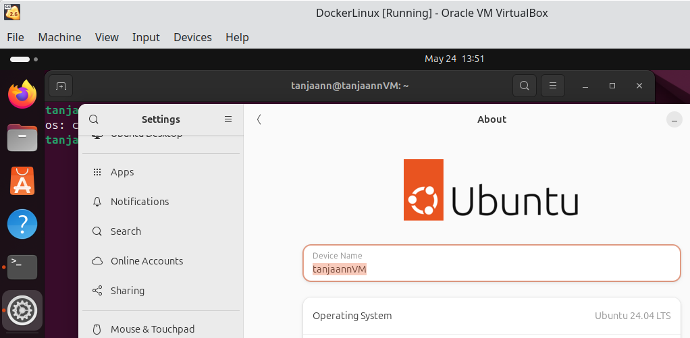

- Затем прожал 
    - **sudo snap install docker**

- И начал выполнять задание..

## Part 1. Готовый докер

##### Беру официальный докер-образ с nginx и пуллю его
- Исспользуя команду:
    - **docker pull** \
    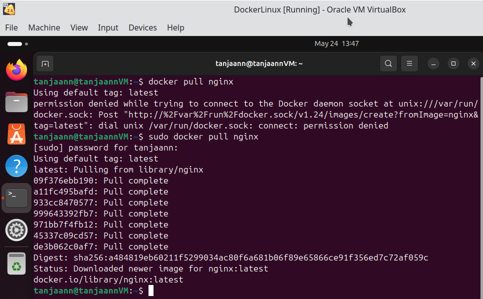

##### Проверяю наличие докер-образа
- Используя команду:
    - **docker images** \
    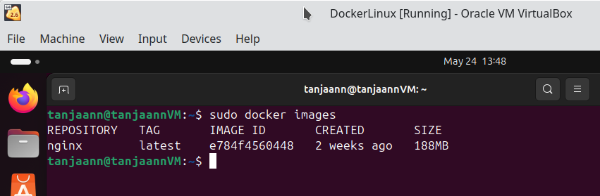

##### Запускаю докер образ
- Используя команду: 
    - **docker run -d e784f4560448** \
    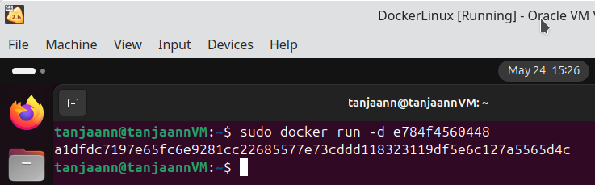

    - Что за команда и что за флаг?
        - Команда запускает докер на основе образа, а флаг **-d** (detached mode) запускает его фоновым процессом и не лочит терминал

##### Проверяю, что образ запустился через
- Используя команду:
    - **docker ps** \
    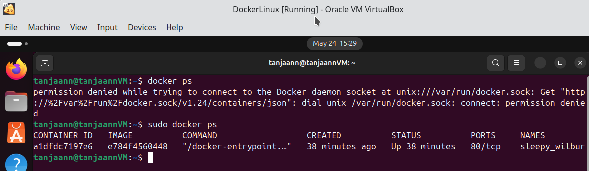

##### Смотрю информацию о контейнере
- Используя команду:
    - **docker inspect e784f4560448** \
    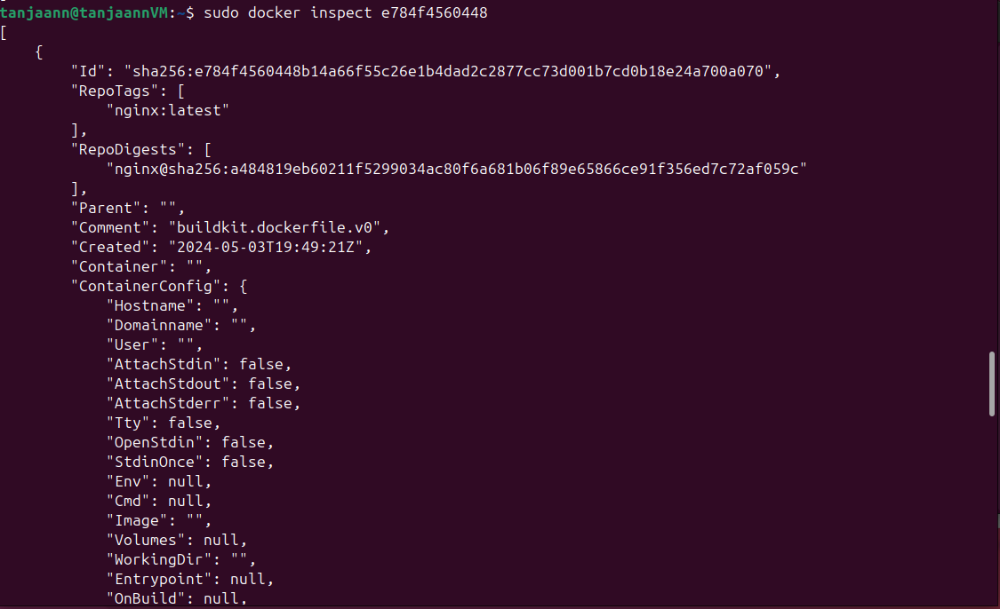

##### По выводу команды определи и помести в отчёт размер контейнера, список замапленных портов и ip контейнера.
- Используя команду типажа:
    - **docker inspect ### | grep ###**
    - **docker inspect --size intelligent_ellis | grep SizeRw -C 1** \
     \
    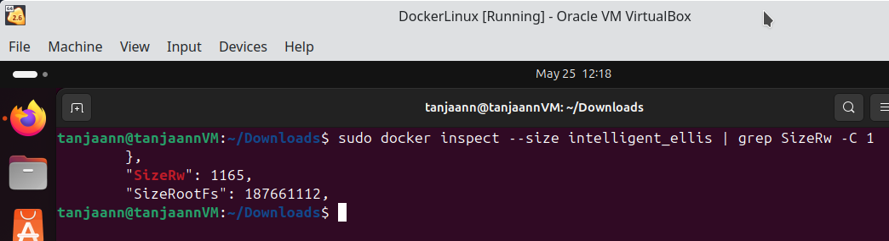
        - **SizeRw** представляет собой размер изменений внесённых в образ
        - **SizeRootFs** это общий размер файлов в контейнере

    - **sudo docker inspect ### | grep Exposed -C 2** \
    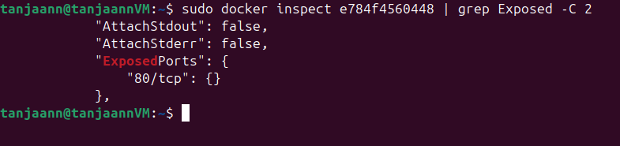
        - флаг **-C 2** расширяет найденный вывод на 2 строки вверх и вниз

    - **sudo docker inspect sleepy_wilbur | grep IPAddress** \
    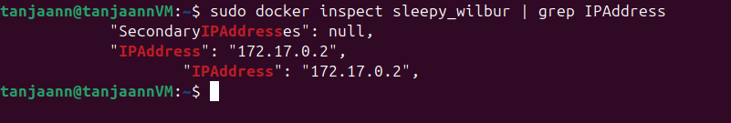
    - Что за **sleepy_wilbur**?
        - Это рандомное имя, человекочитаемое, которое даётся запустившемуся контейнеру.
        - Его можно увидеть через предыдущую команду
            - **sudo docker ps**

##### Остановавливаю докер образ
- Через команду:
    - **docker stop ###**
    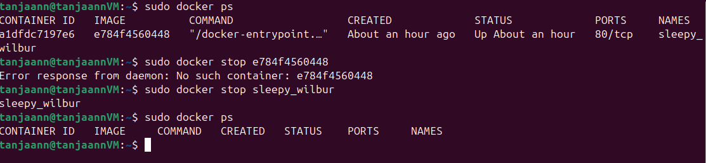
        - Ну и через **docker ps** сразу проверяю выключился ли он

##### Запускаю докер:
- Но с портами **80** и **443** в контейнере, замапленными на такие же порты на локальной машине, через команду:
    - **docker run -d -p 80:80 -p 443:443 ###** \
    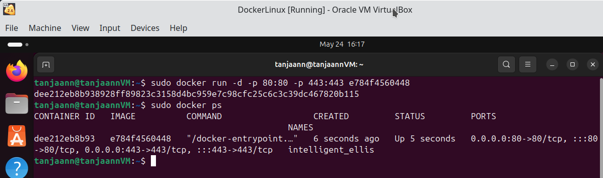
    - Чо за флаги?
        - **-d** запуск фоновым процессом
        - **-p [hostPort]:[containerPort]** число слева это порт **хоста** а справа это порт **контейнера**

##### Проверяю что в браузере по адресу *localhost:80* доступна стартовая страница **nginx**.

- Я порт вводил! Он чтот пропадает почемут из адресной строки браузера~
    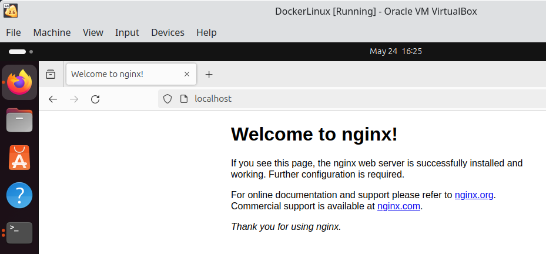

##### Перезапускаю докер контейнер
- Используя команду:
    - **docker restart ###** \
    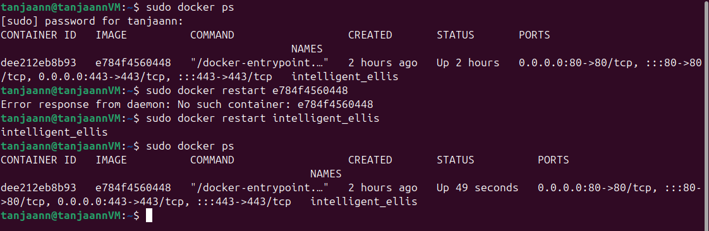
    - И сразу проверяю что он работает командой 
        - **docker ps**

## Part 2. Операции с контейнером

##### Читаю конфигурационный файл **nginx.conf** внутри докер контейнера

- Через команду
    - **docker exec ### cat /etc/nginx/nginx.conf** \
    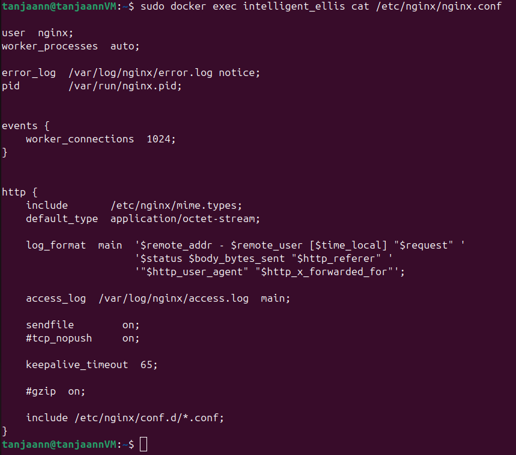

##### Создаю на локальной машине файл *nginx.conf*.
- На компе \
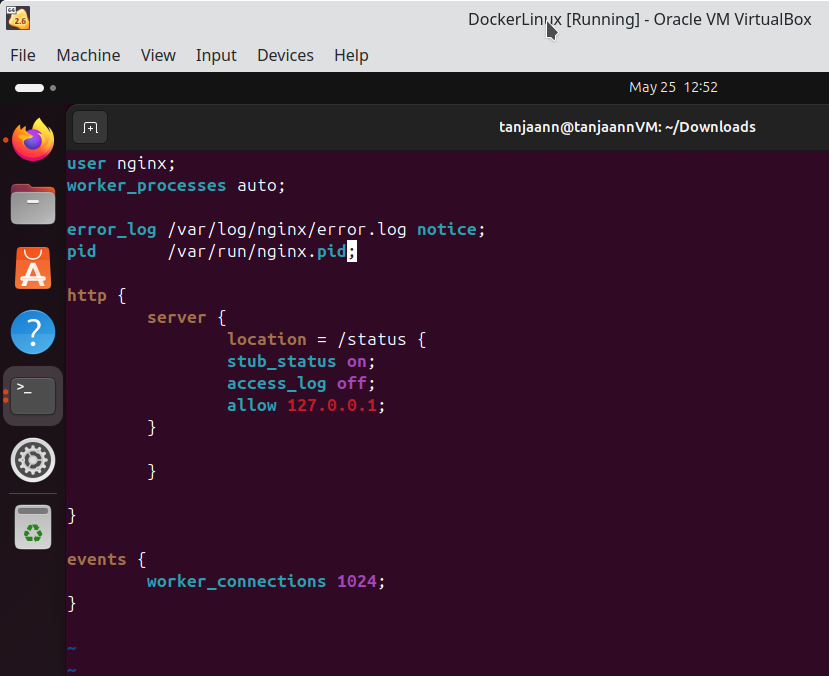

- Можно также проверить синтаксис nginx файла через команду:
    - **docker exec -it --user root intelligent_ellis nginx -t**
    - или просто **nginx -t** 
        - если зайти в сам образ через команду:
            - **docker exec -it --user root intelligent_ellis sh** (sh это bash)

- И настраиваю в нем по пути */status* отдачу страницы статуса сервера **nginx**.

##### Копирую созданный файл *nginx.conf* внутрь докер-образа 
- Через команду
    - **docker cp nginx.conf ###:/etc/nginx/nginx.conf** \
    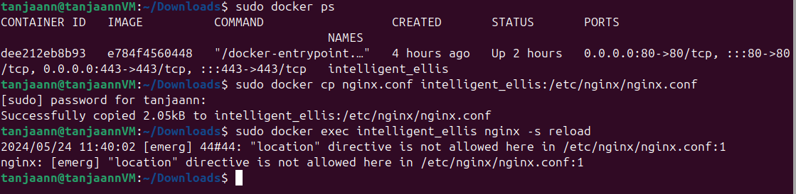
    
    - И сразу пытаюсь перезапустить командой:
    - **sudo docker exec ### nginx -s reload**
    
    - Но будет конфликт из-за существующего **default.conf** в папке **/etc/nginx/conf.d**- надо будет переименовать/удалить/спрятать его

##### Перезапускаю **nginx** внутри докер-образа через команду *exec*. \
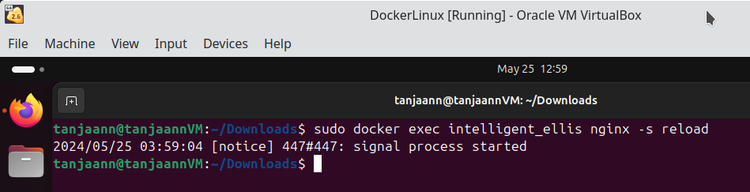

- Также зайдя в **sh** можно тоже прожать **nginx -s reload** и получить тот же результат \
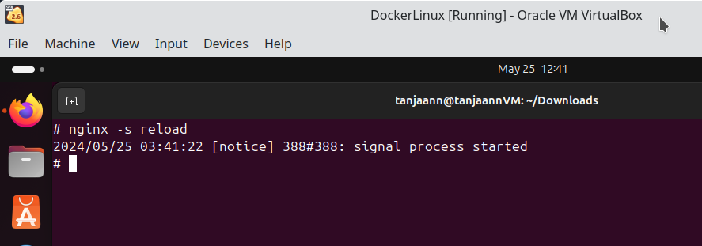

##### Проверяю, что по адресу *localhost:80/status* отдается страничка со статусом сервера **nginx**.
- Захожу через браузер и вижу: \
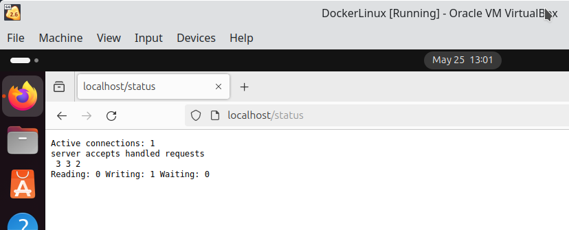

##### Экспортирую контейнер в файл *container.tar* через команду:
- **docker export ### > container.tar** \
    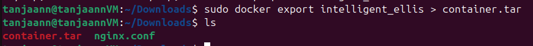
    - Можно также сделать это через флаг **-o** но суть одна и та же
    - Таокй экспорт удобен для создания бэкапа, но он не сохраняет историю слоёв или метаднные. 
        - Если же надо всё это полностью сохранить, то юзать надо **docker save**

##### Останови контейнер.
- Останавливать можно безопасно и с силой (**graceful** and **forced**)
    - **docker stop ###** \
    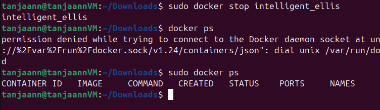
        - В данном случае происходит безопасный выход, с сохранением данных и корреткным выключением. **Но ожидание в 10 секунд**

    ---

    - **docker kill ###**
        - В этом форс выключении выход происходит мгновенно, что может (а может и не можэет) иметь последствия.

##### Удали образ, не удаляя перед этим контейнеры, через команду:

- **docker rmi --force ###** \
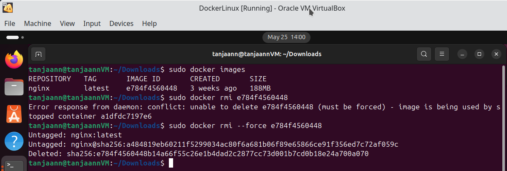
- Можно также использовать **docker rmi -f ###** это просто сокращение

##### Удали остановленный контейнер.
- Можно использовать команду:
    -**docker container prune -f**
    - Чтобы удалить все остановленные контейнеры одной командой сразу

- Но нам скорее нужно точечное удаление, тогда подходит команда:
    - **docker rm [container ID]** \
    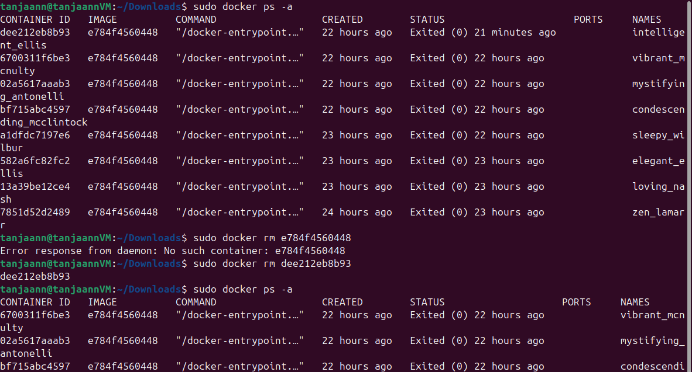
    - Сначала смотрим список всех контейнеров через **docker ps -a**
    - Затем удаляем не по *IMAGE* а по **CONTAINER ID**

##### Импортируй контейнер обратно
- Через команду:
    - **docker import container.tar** \
    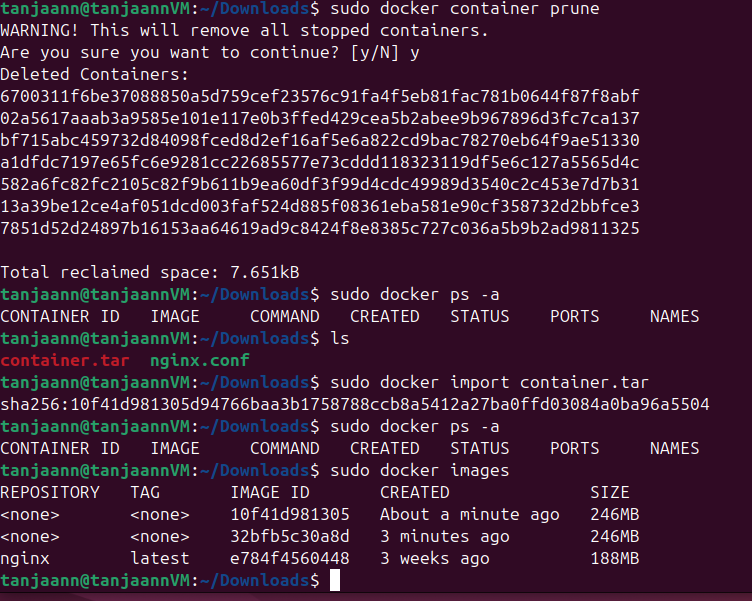
    - Получается сначала я удалил все остановленные контейнеры через **docker prune**,
    - Затем посмотрел список контейнеров через **docker ps -a**
    - Импортировал ранее сохранённый **container.tar** через **docker import container.tar**
    - И через **docker images** посмотрел импортировалось ли оно~ \
    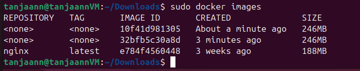
        - Импортировалось.

##### Запусти импортированный контейнер.
- Через прожатие команды:
    - **docker run -d -p 80:80 ### nginx -g 'daemon off;'** \
    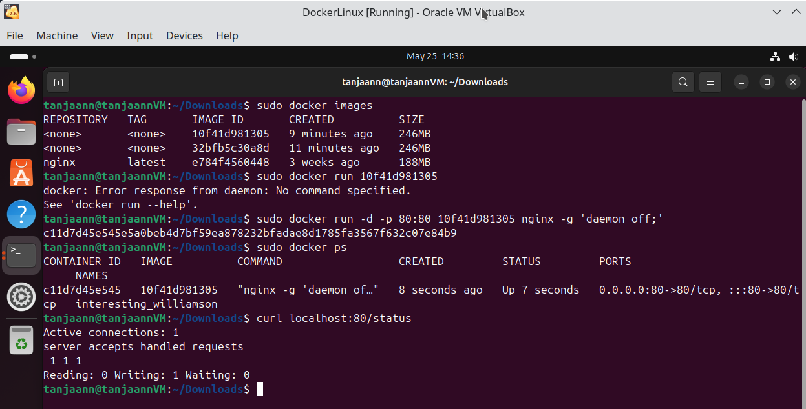
    - Что за синтаксис в команде **docker run**?
        - **-d** detached, запуск в фоне (докера)
        - **-p 80:80** порты 80 контейнера и 80 хоста
        - **nginx** запустит нгинкс сервак
            - **-g 'daemon off;'** *global directive*, о том что *daemon off* - Тоесть запуск нгинкса не фоновым процессом а "главным", для более корректной и безошибочной работы

    - И сразу проверяю через **docker ps** и **закурливание странички** что всё запустилось

##### Проверяю, что по адресу *localhost:80/status* отдается страничка со статусом сервера **nginx**.
- Через браузер на ВМке \
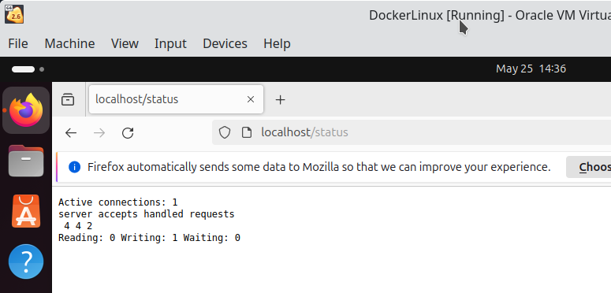

## Part 3. Мини веб-сервер

> Если при попытке включить/перезапустить docker образ который в состоянии **Exited** появляется ошибка:    
    - **error bind: address already in use**
>   - То надо черещ команду \
    - **sudo lsof -i -P -n** \
    - Найти процесс который юзает этот порт (в моём случае это был apache2) и выключить его по PID командой **sudo kill [ ID ]**

- Сначала нужно будет скачать и установить **fastCGI** через команды:
    - **sudo apt-get update**
    - **sudo apt-get install nginx**
    - **sudo apt-get install php-fpm**

##### Напиши мини-сервер на **C** и **FastCgi**
- Который будет возвращать простейшую страничку с надписью `Hello World!`.

    - Создаю файлик на языке **си** \
    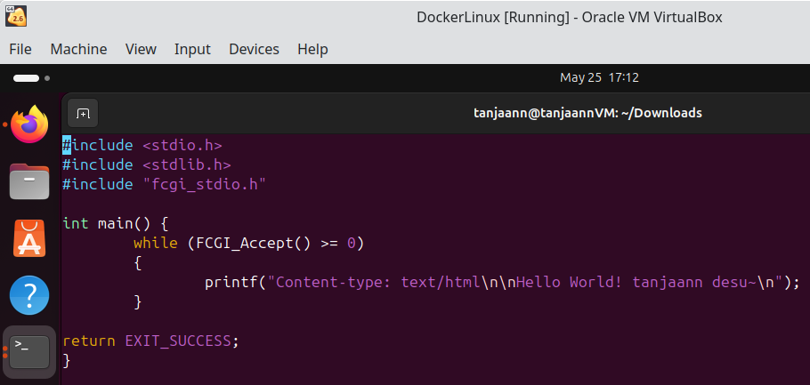

- Копирую его на **контейнер** 
    - **sudo docker cp part3_mini_server.c ###:/etc**  \
    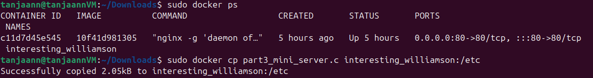

- Захожу в **sh** (тоесть захожу в терминал внутри контейнера) в образе через команду:
    - **docker exec -it ### sh**
        - **-it** interactive, без этого флага терминал будет неИнтерактивен \
    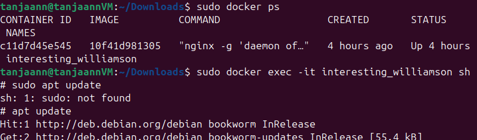
    - Обновляю список приложух через **apt update**
    - И скачиваю нужные библиотеки для поднятия мини-сервера
    - **apt-get install libfcgi-dev**
    - **apt-get install spawn-fcgi**
    - **apt-get install gcc**
    
- Нахожу скопированный **си** файл в папке **etc** (потом перекинул его в папку nginx) \
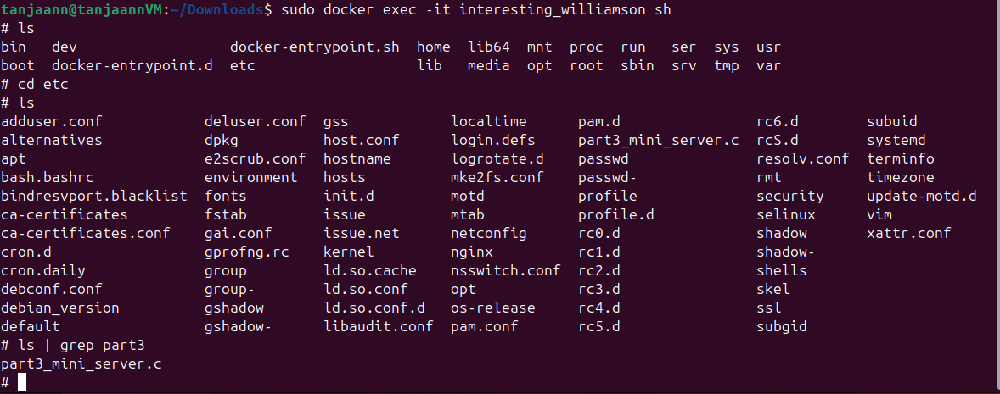

- Компилирую его и запускаю для теста \
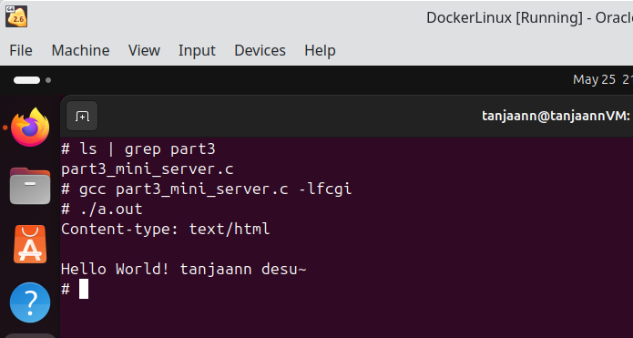

##### Запускаю написанный мини-сервер через *spawn-fcgi* на порту 8080.

- Захожу в интерактивный режи на докер:
    - **sudo docker exec -it ### sh**

- И прожимаю:
    - **sudo spawn-fcgi -p 8080 a.out** \
    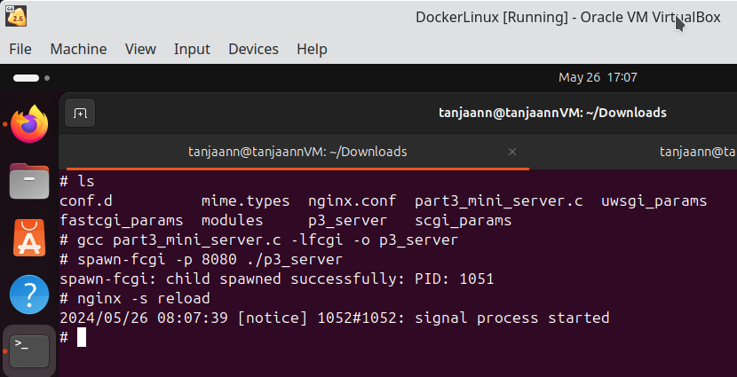

##### Пишу свой *nginx.conf*, который будет проксировать все запросы с 81 порта на *127.0.0.1:8080*.
- Будучи в интерактивном режиме **sh** внутри контейнера, меняю **nginx.conf** на: \
    - Тут получается в папке **/etc/nginx/conf.d** файл **default.conf** был удалён (переименован в BCKP) \
    
    - Имеется только один конфиг **nginx.conf** лежащий по пути **/etc/nginx/nginx.conf**
    - И вот его внутренности: \
    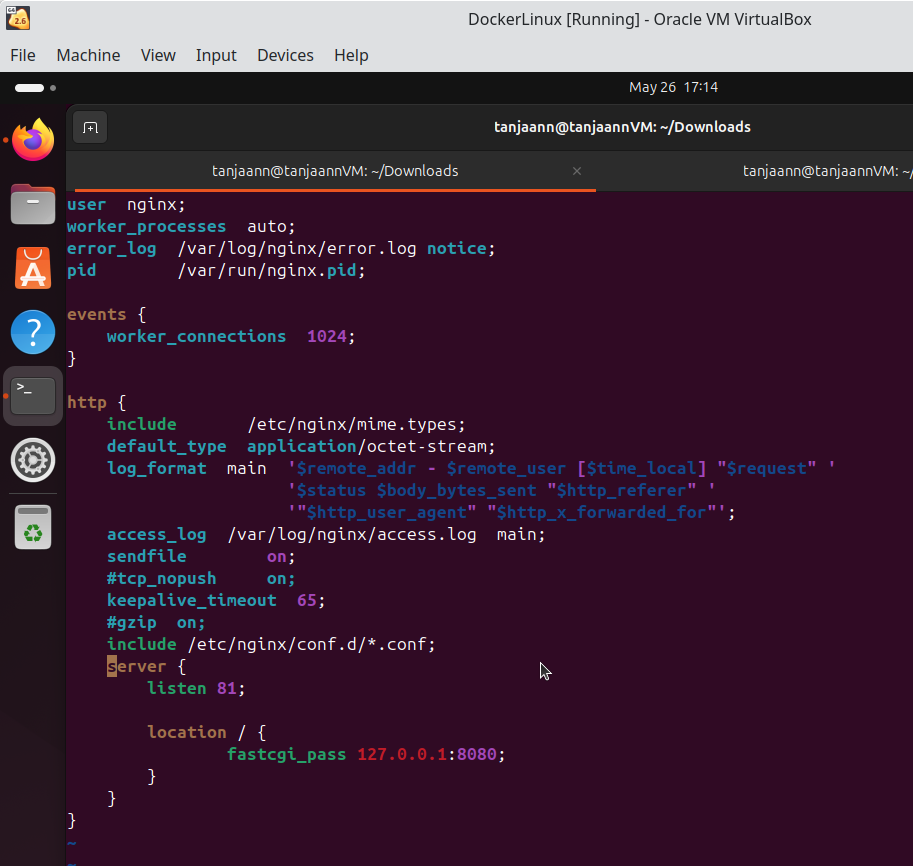 
    - По сути добавляется лишь этот код:
        > listen 81; \
        > location / { \
        >   fastcgi_pass 127.0.0.1:8080; \
        > }

##### Проверь, что в браузере по *localhost:81* отдается написанная тобой страничка.
- Получается нужно зайти в **sh** на контейнер и прожать:
    - **gcc p3_mini_server.c -lfcgi -o p3_server** (названия соответсвенно менять надо в соответсвии с названиями)
    - **spawn-fcgi -p 8080 ./p3_server**
    - **nginx -s reload**

- Захожу на ВМ-ке через браузер на
    - **localhost:81** \
    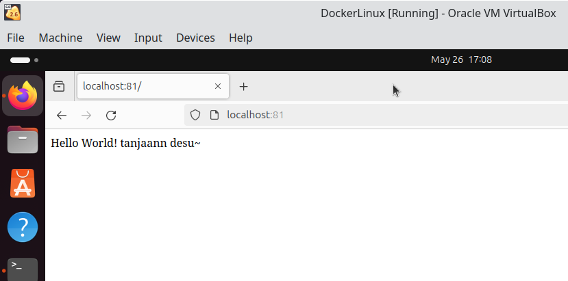

##### Положи файл *nginx.conf* по пути *./nginx/nginx.conf* (это понадобится позже).
- Положил \
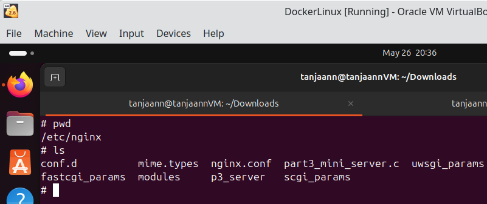

## Part 4. Свой докер

*При написании докер-образа избегай множественных вызовов команд RUN*

- Создаю **Dockerfile** и даю ему права на запуск **chmod +x Dockerfile** \
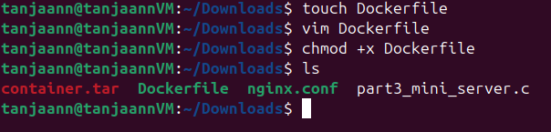

#### Пишу свой докер-образ, который:

##### 1) собирает исходники мини сервера на FastCgi из Part 3

##### 2) запускает его на 8080 порту;
- **spawn-fcgi -p 8080 ./p3m_server**

##### 3) копирует внутрь образа написанный *./nginx/nginx.conf*;
- **COPY ./nginx.conf /etc/nginx/nginx.conf**

##### 4) запускает **nginx**.
- **nginx -g 'daemon off;'** \
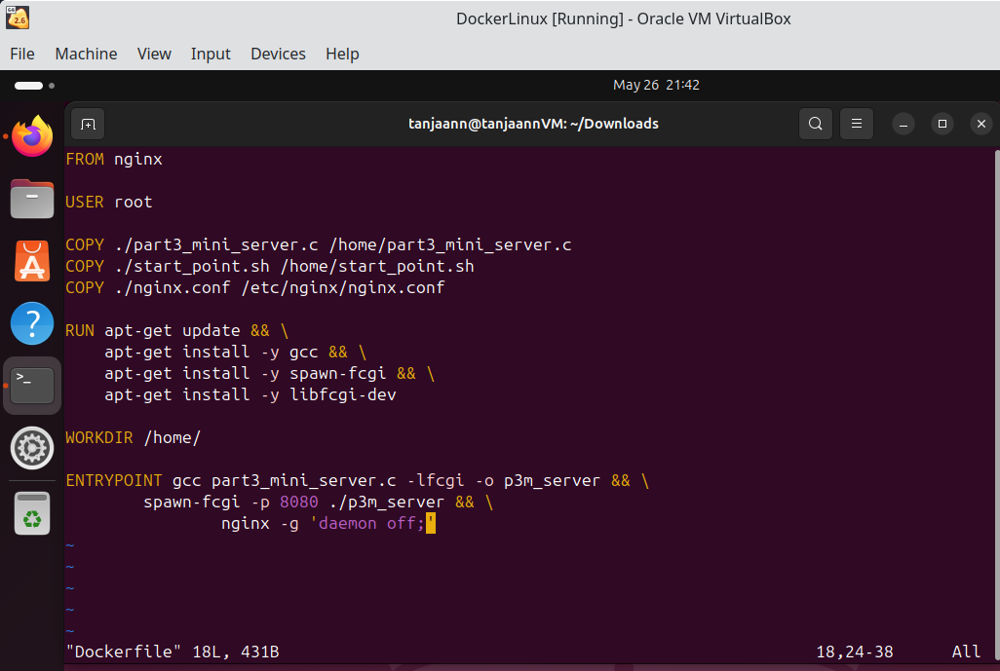

- Пометка из будушего:
    - Строчка **COPY ./start_point.sh /home/start_point.sh** оказалсь не нужна

##### Собери написанный докер-образ через `docker build` при этом указав имя и тег.

- Через команду:
    - **sudo docker build -t [name:tag] .**
        - да, точка тут важна. Типо в этой папке создай билд оно говорит~

    - Билд в процессе \
    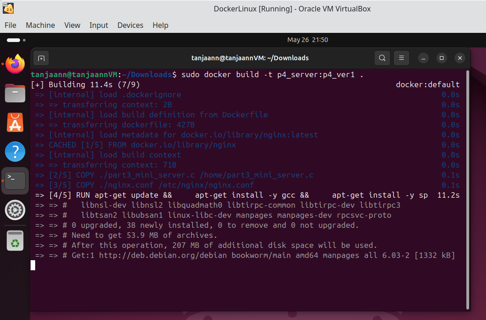

    - Билд готов \
    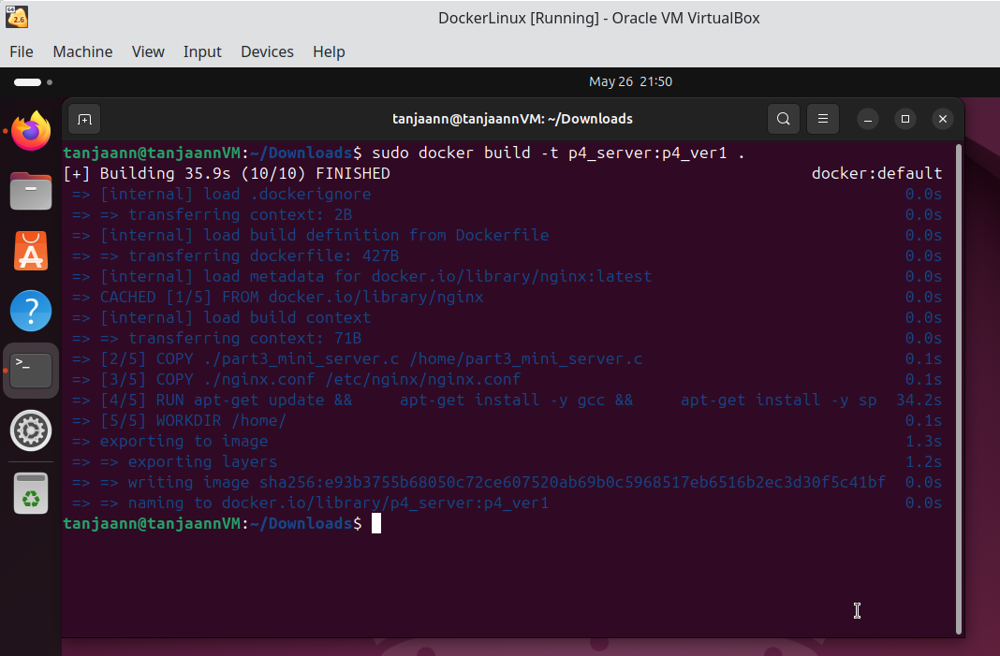

##### Проверь через `docker images`, что все собралось корректно.
- Проверяю, всё есть: \
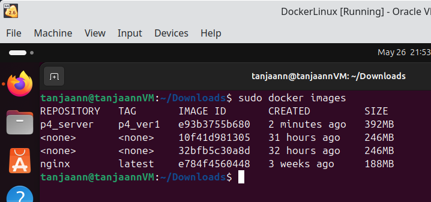

##### Запусти собранный докер-образ с маппингом 81 порта на 80 на локальной машине и маппингом папки *./nginx* внутрь контейнера по адресу, где лежат конфигурационные файлы **nginx**'а (см. [Часть 2](#part-2-операции-с-контейнером)).

- Эээ, кароч командой: 
    - **sudo docker run --name tnjn_server -d -p 80:81 -v $(pwd) p4_server:p4_ver1 sh** \
    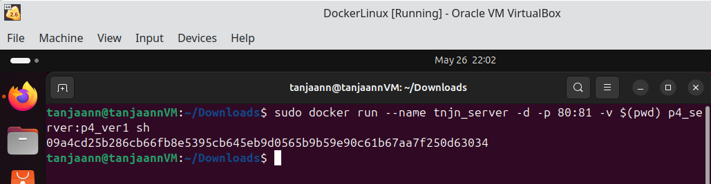

##### Проверь, что по localhost:80 доступна страничка написанного мини сервера.
- Угу пашет \
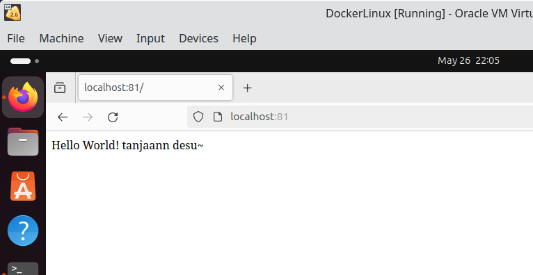

##### Допиши в *./nginx/nginx.conf* проксирование странички */status*, по которой надо отдавать статус сервера **nginx**.
- Дописал: \
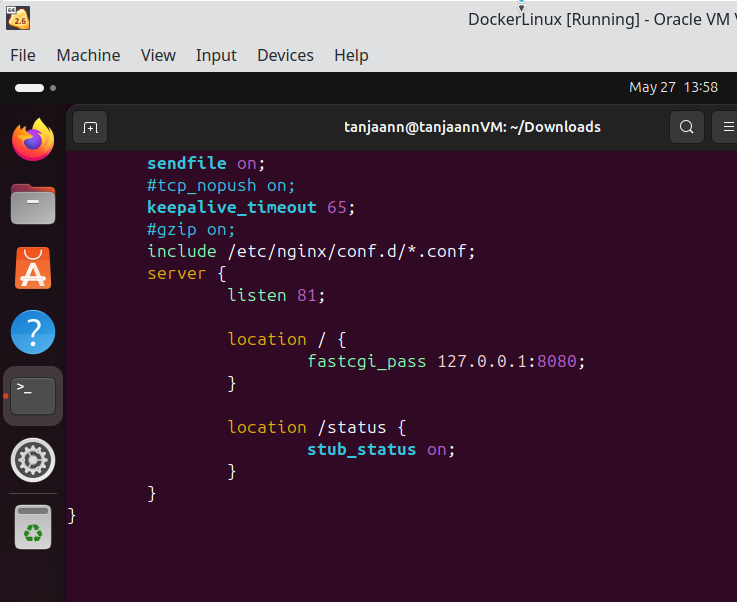
- Конкретно вот эту часть \

- Тепепь копирую этот измененный nginx.conf внутрь образа командой
    - **docker cp  tnjn_server nginx.conf /etc/nginx/nginx.conf** \

##### Перезапусти докер-образ.

- Либо командой
    - **docker restart ###**

- Или же командами
    - **docker stop ###**
    - **docker start ###** \
    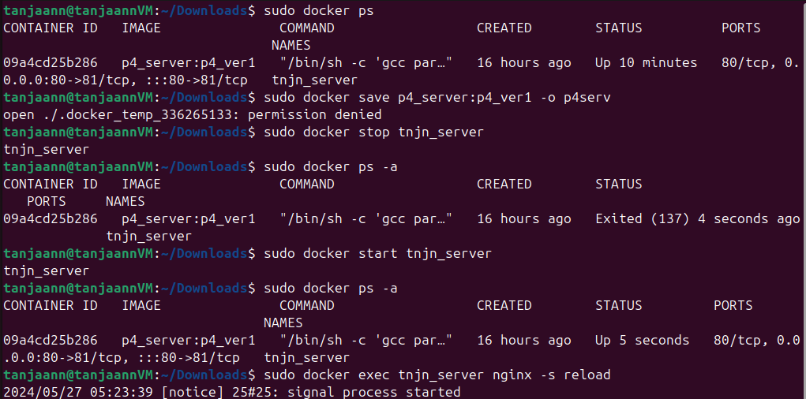
        - На команду **docker save** не смотри, бес попутал~

*Если всё сделано верно, то, после сохранения файла и перезапуска контейнера, конфигурационный файл внутри докер-образа должен обновиться самостоятельно без лишних действий*
##### Проверь, что теперь по *localhost:80/status* отдается страничка со статусом **nginx**

- Можно всё это перезапустить ещё раз: \
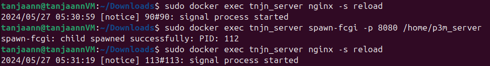

- Если чтот ругается про **address already in use** то надо:
    - установить lsof **apt-get install lsof**
    - и прожать **lsof -i -P -n** чтоб найти PID процесса который порт кушает
    - ну и потом его **kill [PID]**

- Открывается \
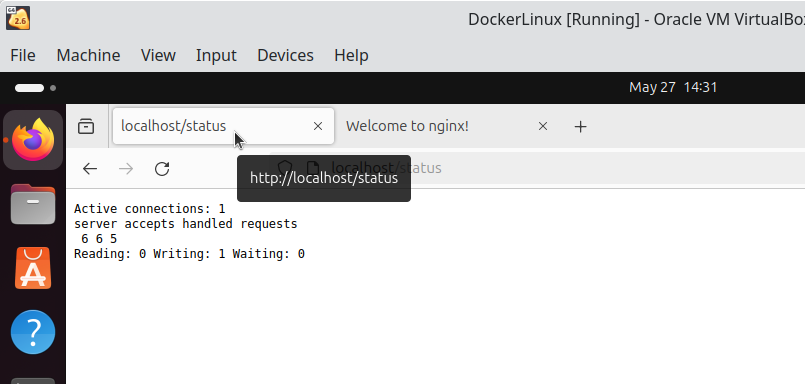

## Part 5. **Dockle**

- Как его установить ваще?
    - На **MacOS** это легко, прост через **brew**
    - На **Ubuntu** ж надо зайти на:
        - **https://github.com/goodwithtech/dockle?tab=readme-ov-file#installation**
    - И там найти как установить. В моём случае это было через: \
    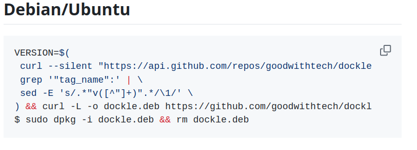
    - Оно чёто там ругалось на $, но прост убираешь этот доллар и устанавливается изи~

---

##### Просканируй образ из предыдущего задания через `dockle [image_id|repository]`.

- ### Скан с ошибками: \
    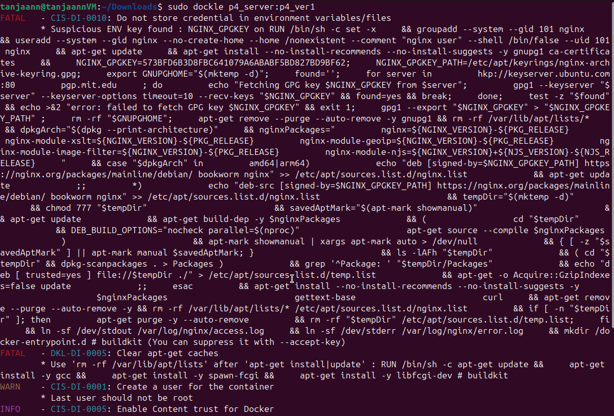 \
    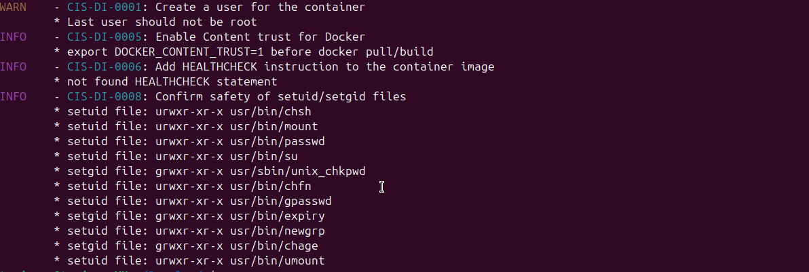

##### Исправь образ так, чтобы при проверке через **dockle** не было ошибок и предупреждений.

- **CIS-DI-0005: Enable Content trust for Docker** чтоб это исправить надо удалить все образы и все контейнеры через:
    - **sudo docker system prune -a**
        - (хотя можн и не удалять, прост nginx образ удалить и запулить его после прожатия следующей команды):
    - Затем уже прожимаем:
    - **export DOCKER_CONTENT_TRUST=1**
    - Потом заново **docker pull nginx** и тогда всё оки чики-пуки
    - Или же помогло то что я зашёл в **root** через команду **sudo -s**? Какойто прикол был в общем связанный с тем что **export** делаем из под обычного юзера без прав на смену этой переменной
    

- **CIS-DI-0010: Do not store credential in environment variables/files** эта ошибка исправляется добавлением строчки при вызове **dockle**
    - **dockle -ak NGINX_GPGKEY -ak NGINX_GPGKEY_PATH [###:###]**

- **DKL-DI-005: Clear apt-get caches** устраняется добавлением строчки в Dockerfile
    - **rm -rf /var/lib/apt/lists**

- **CIS-DI-0001: Create a user for the container** испрявляется добавлением юзера командой в Dockerfile
    - **useradd [name]**

- **CIS-DI-0006: Add HEALTHCHECK instruction to the container image** испрявляется добавлением цели HEALTHCHECK в Dockerfile

- **CIS_DI-0008: Confirm safety of setuid/setgid files** исправляется тоже прожатием команд доступа в Dockerfile, нужно заметить что права где-то **g-s** а где то **u-s**

- Исправленный **Dockerfile** \
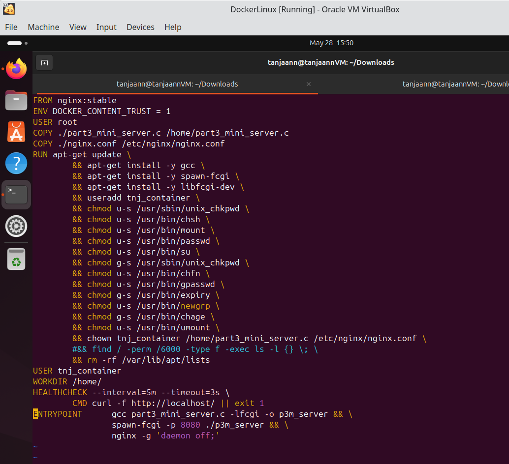

- Билдю через команду:
    - **sudo docker build -t [###:###] .** \

- Проверяю заного:
    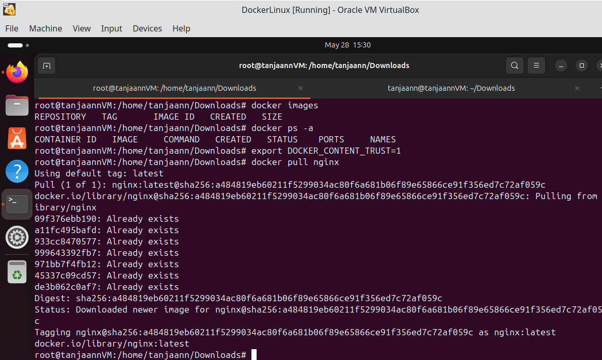
    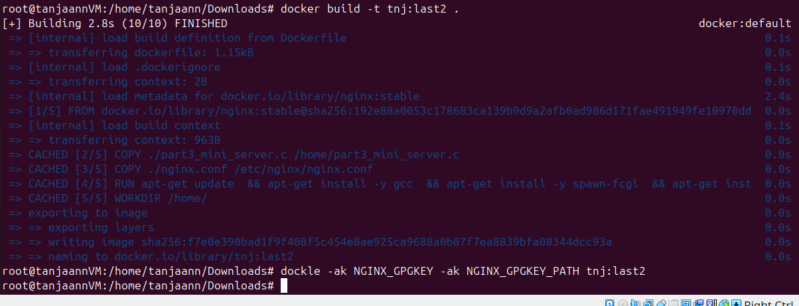
    - **dockle** ничего не пишет в ответ, значит всё пофикшено

## Part 6. Базовый **Docker Compose**

##### Напиши файл *docker-compose.yml*, с помощью которого:
##### 1) Подними докер-контейнер из [Части 5](#part-5-инструмент-dockle) _(он должен работать в локальной сети, т.е. не нужно использовать инструкцию **EXPOSE** и мапить порты на локальную машину)_.
##### 2) Подними докер-контейнер с **nginx**, который будет проксировать все запросы с 8080 порта на 81 порт первого контейнера.
##### Замапь 8080 порт второго контейнера на 80 порт локальной машины.
- Написанный **yml** файл \
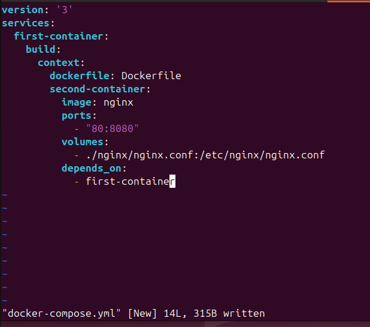

##### Останови все запущенные контейнеры.
- Командой **sudo docker stop $(sudo docker ps -a -q)** \
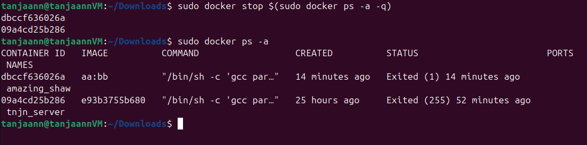

##### Собери и запусти проект с помощью команд `docker-compose build` и `docker-compose up`.
- Прожимаю команды \

##### Проверь, что в браузере по *localhost:80* отдается написанная тобой страничка, как и ранее.
